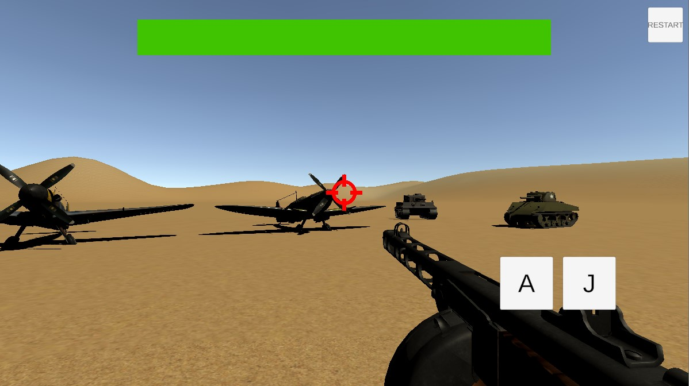
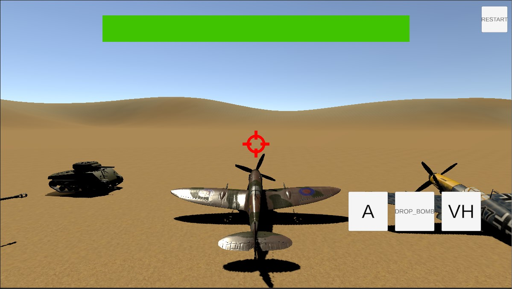
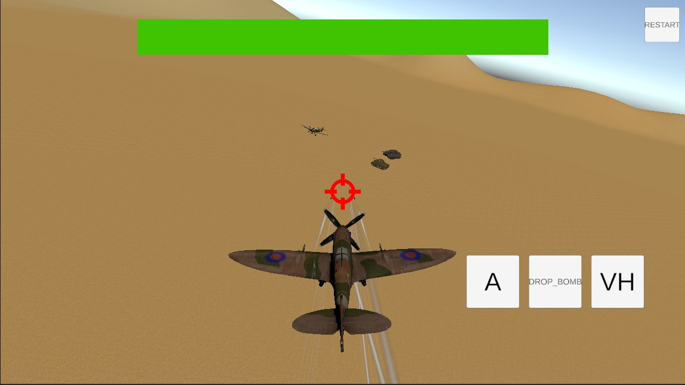
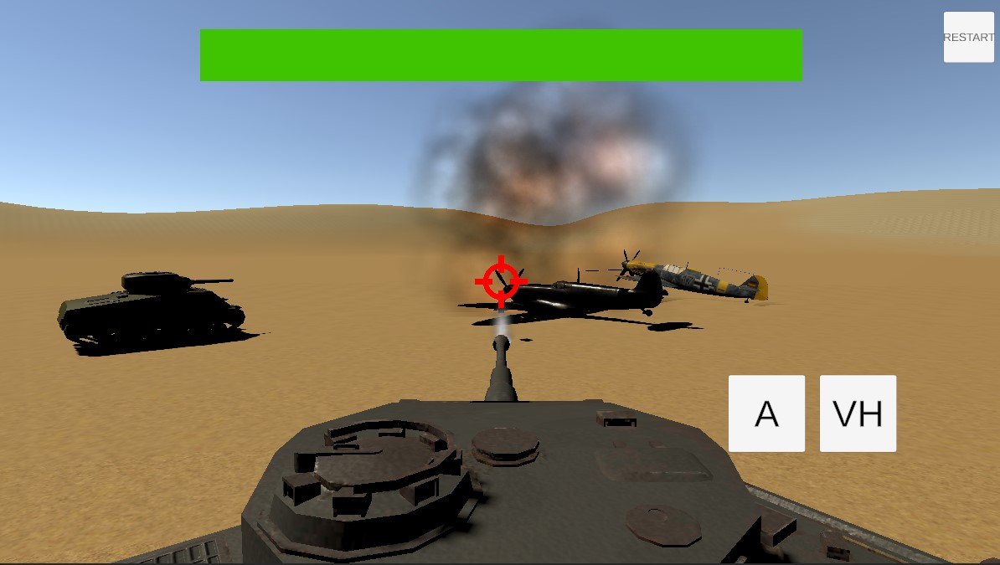
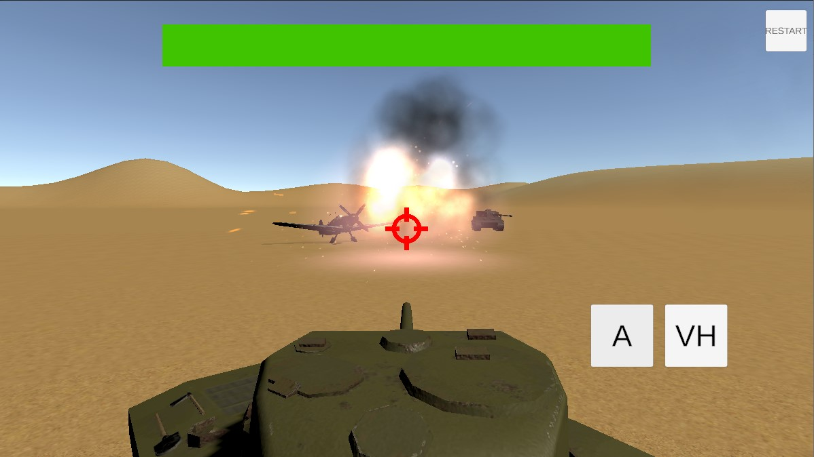

# Mini-WW2 game (Battlefield 1942 like) in Unity3D Sample
### company-ft-battleground-unity

## Features:
### 1. Footman control 
### 2. Airplane control (Spitfire / bf109)
### 3. Panzer control (Sherman / Tiger)
### 4. Good optimization (object pools and so on)
### 5. Scalable archetecture (easy to add new vehicle and setup it)
### 6. Mobile-ready (tested on Android)

## How to play?
### 1. Clone these project and open in Unity3D 2020.1.5f1 or later
### 2. Open _TestScene and tap on Play
### 3. WASD - for move, mouse - rotation , E - interaction with vehicle, R - attack
### 4. On mobile there are two joysticks - left for moving and right for rotation, and UI buttons for actions.

## SCREENS:

